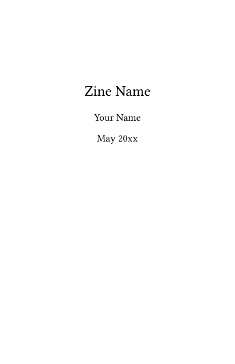
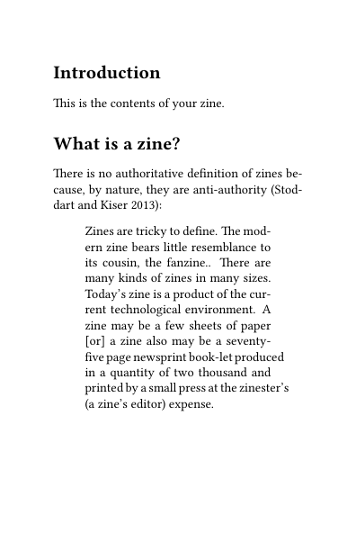

<!-- README.md is generated from README.Rmd. Please edit that file -->

# zinedown

zinedown is an RMarkdown template for making zines. Zines are short
booklets, usually printed in low volumes. They often represent by
do-it-yourself (DIY) culture.

## Installation

You can install zinedown with:

``` r
devtools::install_github("robinlovelace/zinedown")
```

# How does it work?

If you create a new RMarkdown document in RStudio after installing the
package, you should see ‘zine’ as a template option. The pdf output of
this template looks like this:



# A few links:

  - [8-up zine](https://github.com/completeconcordance/8up-zine) a LaTeX
    template for making 8 page zines used in the template
  - [Footprint guidance on printing
    zines](https://www.footprinters.co.uk/zine-printing.html)
  - [pagedown](https://github.com/rstudio/pagedown) which provides an
    alternative (non LaTeX) way to turn .Rmd files into pdfs
